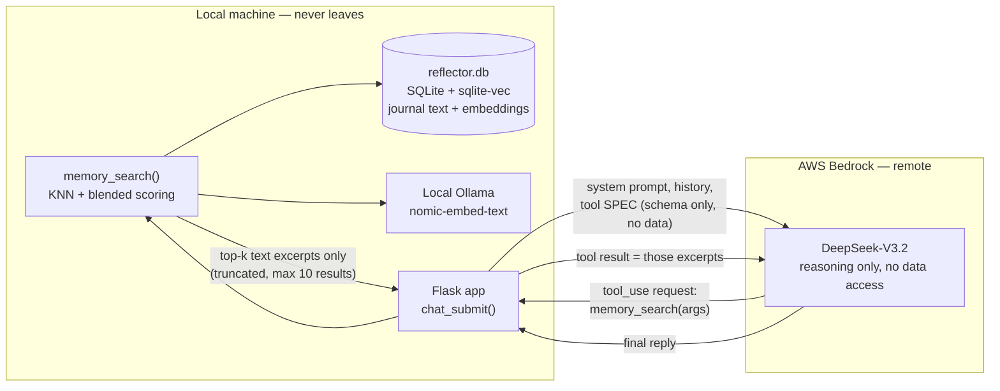
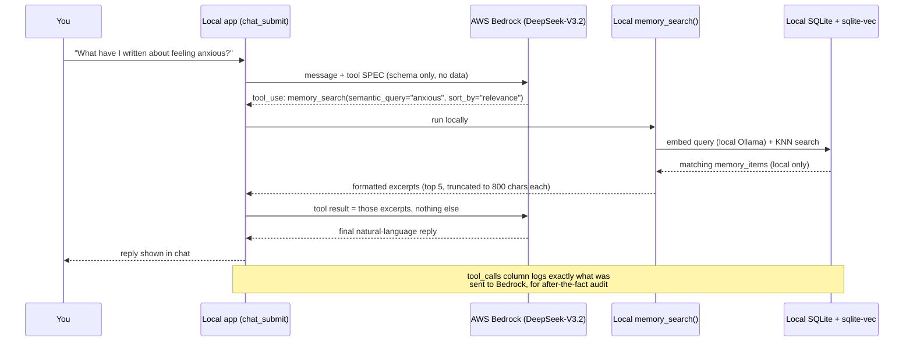

# Reflector

**A privacy-first AI psychologist that learns you over time.**

Reflector is a local-first system for building a longitudinal psychological
companion out of the material that actually reflects a person's inner life:
journal entries, structured clinical self-assessments (PHQ-9, GAD-7, PCL-5),
and ongoing conversation. Instead of a stateless chatbot that starts from
zero every session, it aims to hold a standing, evolving understanding of
one specific person — the way a long-term therapist does, not the way a
generic assistant does.

## Why this exists

Most AI mental-health tools are either shallow (no memory, no real context)
or invasive (your most private writing sent to and retained by a third
party by default). Reflector is built to resolve that tension rather than
split the difference: **your raw content should never have to leave your
own machine to get a system that actually knows you.**

## What it does

- **Ingests** years of journal entries, structured self-assessments, and
  chat history into one normalized, longitudinal memory layer.
- **Extracts** psychological signal per entry — emotional themes, cognitive
  patterns, stressors, sentiment — via schema-constrained local model
  inference, not free-text summarization.
- **Aggregates** that signal over time into trends, recurring patterns, and
  a standing profile — the compressed, synthesized understanding a
  conversational agent reasons from, instead of re-reading a life's worth
  of raw text every session.
- **Converses**, grounded in that profile plus targeted retrieval plus
  assessment trends — able to answer questions like *"what was the most
  emotionally charged thing that happened to me in 2024, and how did I
  respond?"* by turning natural language into structured queries over your
  own history.
- **Runs on a spectrum of models**, local and frontier, so you can choose
  the privacy/capability tradeoff per layer — or even run multiple
  differently-configured "AI psychologists" side by side and compare
  perspectives, rather than trusting a single model's take on you.

## Privacy model

Every architectural decision is downstream of one rule: **your raw content
never leaves your machine by default.** Concretely:

- Structured extraction from raw journal/conversation text runs on
  self-hosted, local models — never a shared public API.
- Any use of a frontier model for deeper reasoning is opt-in, deliberate,
  and scoped to derived/structured signal wherever possible — not raw
  content, and not by default.
- Nothing about this project's data — journal exports, processed entries,
  the vector store, the local database — is ever meant to leave your
  machine or be published; only the system that operates on it is open.

### How retrieval stays private when the chat model is remote

The chat layer runs on a remote model (currently AWS Bedrock), but the
vector search, the embeddings, and the database itself never leave the
machine. Bedrock can't query anything on its own — it can only *ask* the
local app to run a search, and only the resulting text excerpts (never the
database, never the index) cross the network.

See [`docs/ARCHITECTURE.md`](docs/ARCHITECTURE.md) for the full design,
including the model-hosting tiers and the tradeoffs between them, and
[`docs/RETRIEVAL_PRIVACY.md`](docs/RETRIEVAL_PRIVACY.md) for the full
step-by-step walkthrough and how to audit any chat turn yourself.

## The long-term goal

The near-term goal is a system that helps one person understand their own
patterns over time, grounded in their own real history rather than generic
advice. The long-term, much-further-out goal is more ambitious: a
sufficiently rich, longitudinal model of a person's psychology,
communication style, and thought patterns that it could stand as a
genuine, convincing likeness of them — for their own reflection, or for
future generations who want to know them.

That end goal is currently out of reach, and honestly may stay that way
for a long time — it depends on model capability that doesn't fully exist
yet. This project is being built incrementally toward it anyway, with each
layer (extraction → aggregation → synthesis → conversation) useful on its
own well before the final goal is anywhere close.

## Status

**Alpha.** This is a personal, actively-evolving research project, not a
finished product, and will likely stay in alpha for years — both because
the scope is large and because parts of the vision are gated on model
capability improving. Expect rough edges, in-progress pieces, and
architecture that shifts as real usage teaches us what actually matters.
See [`docs/ROADMAP.md`](docs/ROADMAP.md) for what's built vs. still open.

## Disclaimer

Reflector is not a licensed therapist, not a crisis service, and not a
substitute for professional mental health care. If you are in crisis or
need immediate support, please contact a local emergency service or a
crisis line in your country. This project includes hardcoded (non-AI)
crisis-resource routing on clinical risk indicators as a safety floor, but
that is a supplement to real care, not a replacement for it.

## License

See [`LICENSE`](LICENSE).
