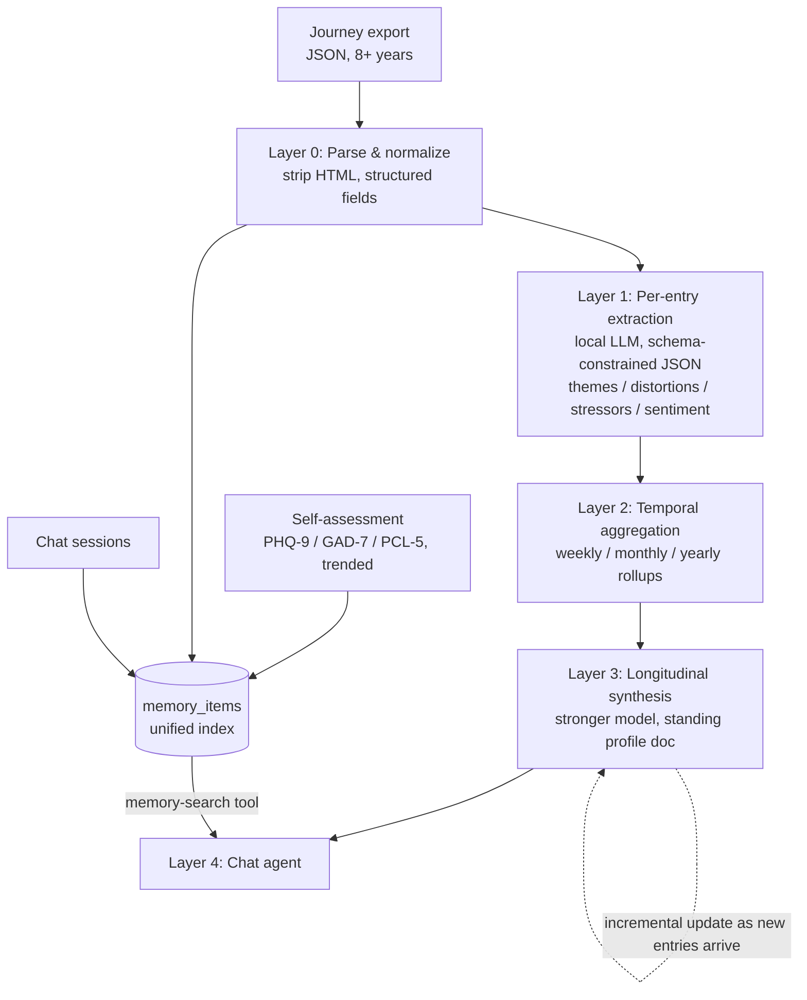

# Reflector — Architecture

A local-first system that ingests years of daily journal entries and turns them
into a coherent psychological picture a conversational agent can reason over —
without any raw journal content leaving the machine.

## Guiding constraint: privacy

Every design decision below is downstream of one rule: **journal content never
leaves this computer.** Practically, that means:

- The reasoning/synthesis models are self-hosted (local, or private
  infrastructure the user exclusively controls) — never a shared public API.
- Every script in this pipeline prints counts/stats to stdout, never entry
  content, since script output can end up in front of a cloud-hosted coding
  assistant during development.
- `data/` (raw exports, processed entries, the vector store) is fully
  gitignored.

## The four layers

Raw entries can't just be dumped in an LLM's context — 8 years of daily
writing is too much text, and raw text isn't structured for psychological
reasoning. The pipeline compresses in stages, the same way a human therapist
holds a synthesized understanding of a client rather than re-reading their
whole life every session.

### Layer 1 — Per-entry structured extraction

Every entry is run through a local LLM pass that extracts, not summarizes:
emotional themes, named cognitive patterns (catastrophizing, black-and-white
thinking, etc.), stated stressors, relationships/people mentioned, coping
behaviors, and a normalized sentiment score. Output is schema-constrained
JSON (Ollama structured outputs), not free text. Each entry ends up as
`{raw text, structured tags}`.

### Layer 2 — Temporal aggregation

Per-entry tags are rolled up into weekly/monthly/yearly summaries: mood
trend lines, recurring-theme frequency, timeline of notable events. This
turns "1,800+ documents" into a much smaller, tractable time-series +
thematic-frequency problem.

### Layer 3 — Longitudinal synthesis

The aggregated rollups (not raw entries) feed a stronger reasoning pass that
produces a standing **profile document**: recurring patterns, what's
improved or regressed, life events correlated with mood shifts. This is a
living document, updated incrementally as new entries arrive — not
regenerated from scratch per conversation. This is the layer most sensitive
to model quality, since it requires real reasoning over abstracted patterns.

### Layer 4 — Runtime (the chat agent)

Every conversation gets three things in context: the standing profile
(background), retrieval over past material (specific evidence/quotes when
a topic comes up), and structured self-assessment scores tracked over time
(PHQ-9/GAD-7/etc., trended, not one-shot). Together these are the "full
psychological assessment" — it's a system, not a single document. How that
retrieval actually works across all three data sources is its own layer,
covered next.



## The unified memory layer (journal + assessments + chat)

There are three data sources, not one, and they don't share a native shape:
journal entries are rich free text with structured metadata; assessments are
pure numbers/categories with no free text at all; chat is bursty
conversational turns that only become a comparable unit once grouped into
sessions. Retrieval/recall logic that has to know about all three shapes
individually can't be experimented with — every new recall strategy would
mean touching three different integrations. So there's a normalization layer
that sits above the three native tables (`entries`, `assessments`,
`chat_sessions`), which stay the full-fidelity source of truth:

```sql
CREATE TABLE memory_items (
    id INTEGER PRIMARY KEY AUTOINCREMENT,
    source_type TEXT NOT NULL,      -- 'journal_entry' | 'assessment' | 'chat_session'
    source_id TEXT NOT NULL,        -- FK back to the native record
    occurred_at TEXT NOT NULL,      -- shared timestamp — the join key across all three
    summary_text TEXT NOT NULL,     -- normalized text, what gets embedded
    sentiment_score REAL,
    emotional_intensity INTEGER,
    notable BOOLEAN,
    risk_flag BOOLEAN,
    UNIQUE(source_type, source_id)
);
CREATE TABLE memory_item_themes (memory_item_id INTEGER REFERENCES memory_items(id), theme TEXT);
CREATE TABLE memory_item_emotions (memory_item_id INTEGER REFERENCES memory_items(id), emotion TEXT, rank INTEGER);
-- embeddings keyed to memory_items.id, one vector store for all three sources
```

**Adapters, one per source, all targeting this same shape:**
- **Journal** → one `memory_item` per entry, fields come straight from
  Layer 1 extraction.
- **Chat** → one `memory_item` per session (sessions = messages grouped by a
  time-gap boundary), fields come from a session-level extraction pass using
  the *same* emotion/theme/distortion enums as the journal (`schema.py`) —
  this shared vocabulary is what makes cross-source correlation possible at
  all, e.g. noticing the same cognitive distortion shows up in both a
  journal entry and a chat session about the same topic.
- **Assessments** → one `memory_item` per submission. Honest asymmetry:
  there's no free text to extract from, so `summary_text` (e.g. "GAD-7
  taken, total 14, Moderate"), `emotional_intensity`, and `notable` are
  *derived by rule* from the score/severity, not extracted by a model.

**Why this buys modularity:** every recall strategy — pure semantic,
emotion-weighted, anniversary-boosted (same time of year, prior years),
salience-boosted, or some blend — becomes a scoring function over one table,
blind to which source a hit came from. Swapping recall strategies never
touches ingestion code, and a fourth data source later is just one more
adapter targeting the same shape.

**Recall as multiple scoring axes**, not single-axis cosine similarity —
loosely following the memory-scoring approach from Stanford's "Generative
Agents" work and the tiered-memory idea from MemGPT/Letta:
- *Ideas* — semantic embedding similarity (standard RAG)
- *Emotions* — shared emotional texture (`sentiment_score`,
  `emotional_intensity`, `memory_item_emotions`), independent of topic
- *Times* — recency decay, but also anniversary effects ("same time of
  year, prior years") via `occurred_at` date math
- *Salience* — `notable` / `risk_flag`, so a handful of significant memories
  outweigh their semantic score alone, the way real memory works

**Agentic, not force-fed:** the chat agent gets a callable memory-search
tool rather than a fixed retrieval block injected before every turn — it
decides mid-conversation when it needs to look something up. That tool is
also, not coincidentally, a natural-language-to-structured-query mechanism
over `memory_items` — the same skill as the SQL-agent goal, doing double
duty.

**Relating across sources:** start with implicit joins on the shared
`occurred_at` column (e.g. "what else happened around this date") rather
than precomputed relationship edges — cheap, flexible, no staleness to
manage. Only graduate to explicit precomputed edges if a specific
relate-pattern turns out to be expensive to compute on the fly.

**`memory_items` is a rebuildable index, not a source of truth.** Since
Layer 1 extraction quality is still being validated and chat
session-extraction doesn't exist yet, it should be treated like a
materialized view — droppable and fully regeneratable from the native
tables as extraction models and taxonomies improve, never hand-authored or
treated as authoritative on its own.

## Model-hosting tiers (see project discussion for full tradeoff table)

1. **Fully local** (Ollama on-device) — zero network exposure, quality ceiling
   set by local hardware.
2. **Self-hosted on rented GPU** (RunPod/Lambda Secure Cloud, private
   instance) — near-frontier open-weight models (GLM-5.2, Kimi K2.6/K3,
   DeepSeek-V3, Qwen3-235B), data leaves the Mac but never touches a shared
   public API.
3. **Confidential computing (TEE)** — same as tier 2 with hardware
   attestation/encryption closing the "datacenter operator" trust gap.
4. **Public cloud API** — explicitly ruled out for this project; frontier
   quality but data reaches a third party's servers.

Layers 1–2 run fine on local models. Layer 3 (synthesis) is the layer most
worth upgrading to tier 2/3 if local quality proves insufficient.

## Status

This file documents the design and its rationale — it doesn't track
day-to-day progress. For what's actually built vs. still open, see
`docs/STATUS.md`, which is the living tracker.

The `memory_items` unified layer above is a design decision, not yet
implemented — it's the agreed shape for the retrieval work still ahead in
Task #3, once Layer 1 extraction (Task #7) clears the gold-standard eval.
