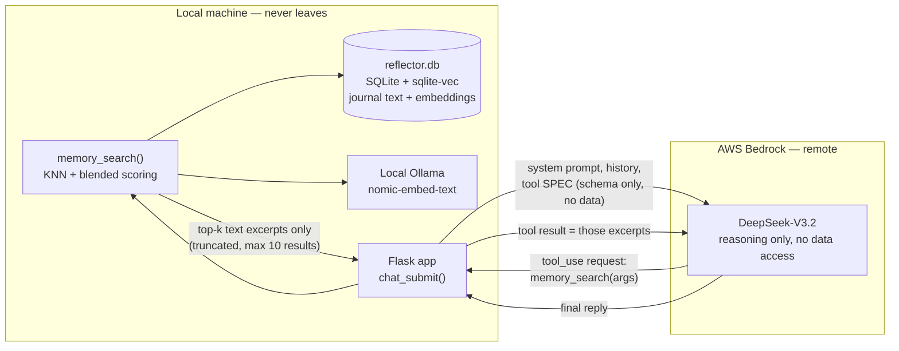
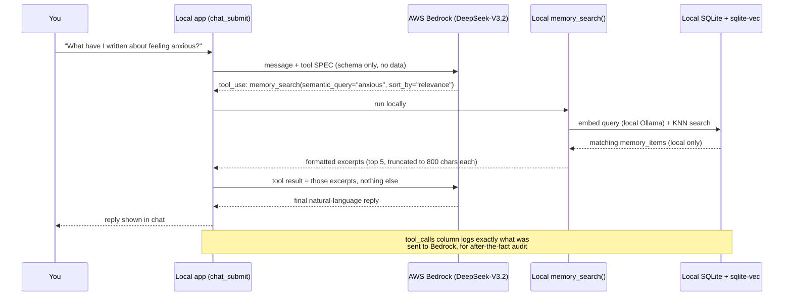

# How RAG retrieval keeps journal data private

Reflector's chat layer runs on AWS Bedrock (a remote model) so conversation
quality doesn't suffer, but the journal itself — the raw text, the vector
index, the search — never leaves the machine. This document is the concrete
mechanism behind that claim: what's local, what's remote, and exactly what
crosses the network on a single chat turn.

## What's local vs. what's remote

| Component | Where it runs |
|---|---|
| `data/reflector.db` (journal text, embeddings) | Local disk only |
| `memory_embeddings` (sqlite-vec vector index) | Local — part of that same SQLite file |
| Embedding generation (`nomic-embed-text`) | Local Ollama |
| The KNN vector search + blended relevance scoring | Local Python (`reflector/memory_search.py`) |
| The chat model (currently DeepSeek-V3.2) | AWS Bedrock — remote |

Bedrock has no connection to the database, the filesystem, or local Ollama.
It cannot query anything on its own — it can only *ask* the local app to run
a search, the same way a person might ask an assistant to look something up
rather than being handed the filing cabinet.



## One chat turn, step by step



1. **You send a message.** The request to Bedrock includes the system
   prompt, your latest assessment scores, a list of document *titles* (not
   content), recent history, and your message — plus a *tool spec*, which is
   just a JSON description of `memory_search`'s parameters. A menu, not data.
2. **Bedrock can ask to search instead of answering immediately** — it
   returns a structured request like `memory_search(semantic_query="feeling
   anxious", sort_by="relevance")`. This is a request, not a query it runs
   itself; Bedrock has no execution access to anything.
3. **The local app runs the search.** `BedrockProvider.chat()`, running on
   your machine, catches that request and calls the real `memory_search()`
   function locally: embeds the query via local Ollama, does the KNN search
   against the local `memory_embeddings` table, pulls matching rows from the
   local `memory_items` table, applies the blended relevance scoring
   (semantic + recency + salience + emotion). No network call happens here.
4. **Only the result excerpts go back to Bedrock** — a formatted block of
   the top few matches, each truncated to 800 characters, capped at 10
   results. This is the only journal content that ever crosses the network,
   and only because the model specifically asked for it.
5. **Bedrock writes the final reply** using only what it was actually given.
   Steps 2–4 can repeat (search again for something else) up to 5 times in
   one turn before it has to produce an answer.

## Privacy properties this gives you

- **No standing access** — Bedrock never holds a connection to your data. It
  is strictly request → local execution → response, one search at a time,
  only when the model decides it needs to.
- **Only relevant excerpts travel, never bulk data** — not the database
  file, not the vector index, not the full journal. A handful of truncated
  snippets per search call, at most.
- **Fully auditable, not just trusted** — every real search (the exact query
  arguments and the exact result text sent to Bedrock) is logged locally in
  `chat_messages.tool_calls`, so what actually crossed the boundary is
  checkable after the fact, not something you have to take on faith.

## Verifying it yourself

After any chat message, check what a turn actually sent:

```
.venv/bin/python -c "
from reflector.db import get_connection
conn = get_connection()
row = conn.execute('SELECT content, tool_calls FROM chat_messages WHERE role=\"assistant\" ORDER BY id DESC LIMIT 1').fetchone()
print('REPLY:', row['content'][:200])
print('TOOL CALLS (exact args + results sent to Bedrock):', row['tool_calls'])
"
```

See `docs/ARCHITECTURE.md` for the full four-layer pipeline design, and
`reflector/memory_search.py` / `reflector/llm/providers.py` for the actual
implementation this document describes.
